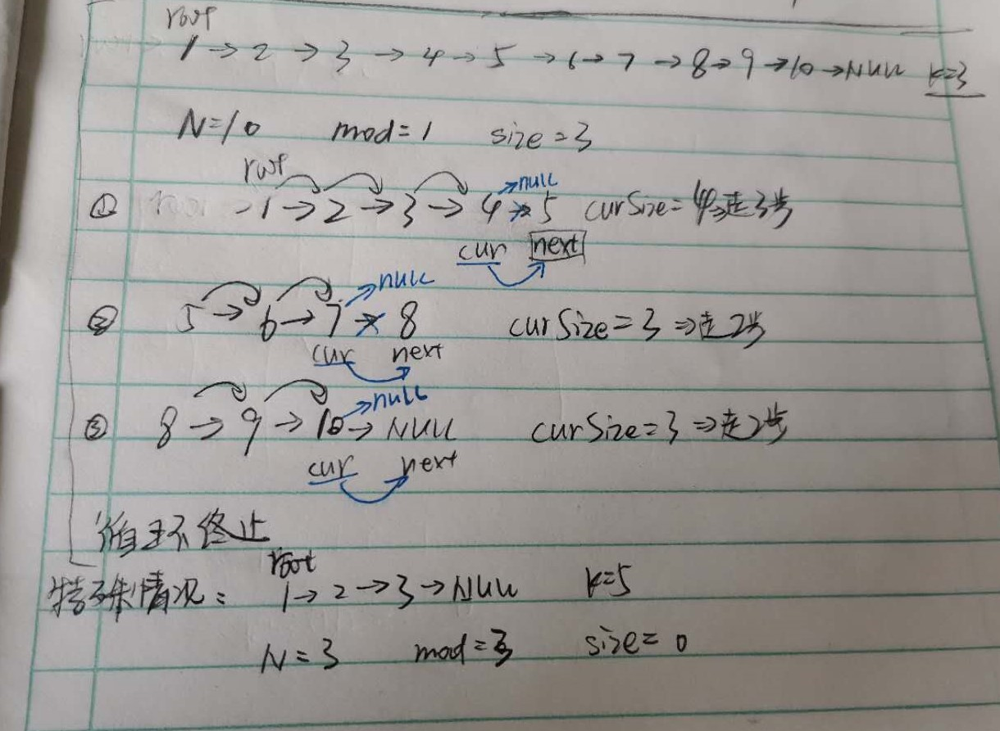

# Leetcode 链表专题-总结

## 题目解法:

### 21.合并两个有序链表

```
输入:1->2->4, 1->3->4 输出:1->1->2->3->4->4
```

#### 法一:常规方法

新建一个链表头，将题中两个链表表头数字比大小，小的"取出"(把小的结点连接到新链表后，然后把指针后移)，如此循环直到某一个链表为空表以后，把另一个链表直接接在后面即可。

#### 法二:递归法

1.终止条件:其中一个链表为空，此时返回另一个链表。

2.返回值:后半部分已经排序好的链表

3.本级递归应该做什么:将已排序好的链表(下一级递归返回值)接在当前比较中数字小的结点的后面，然后返回当前结点的指针(即返回了排序好的链表)

### 160.相交链表

#### 法一:双指针法

1.创建两个指针pA,pB,分别初始化为链表A和B的头结点。然后让他们向后遍历，同时比较pA,pB是否相等。

2.当pA到达链表尾部的时候，就将它重点位到链表B的头结点(此处可以结合1利用 ？ ：表达式来实现)，同理，pB到达链表尾部时，重定义到链表A的头结点。

3.若遇到pA=pB，则此结点为相交结点

时间复杂度:O(m+n)  空间复杂度:O(1)

（链表A，B长度大概率不同，那么通过A+B和B+A使得链表长度相同，再遍历比较即可）


### 206.反转链表

#### 法一:头插法

每次把新的结点插入到表头后面，即可实现反转。(需要一个表头的虚拟结点才可实现)


#### 法二:递归法*

1.终止条件:链表为空(特殊情况)或者只有一个元素时，返回表头（链表最后一个结点变成新的头结点）

2.返回值:返回后半部分已经完成反转的链表表头

3.本级递归应该做什么:(处理前:head->next->已处理好的链表     处理后:next->head->已处理好的链表) 

先调用下一级递归，并把结果赋给newhead,然后将head和next反转方向，返回newhead


### 83.删除排序链表中的重复元素

#### 法一:遍历法

从头到尾遍历链表，如果当前结点的值等于下一结点的值，那么将下一个节点删除。(只用一个指针即可实现)

#### 法二:递归法

1.终止条件:当链表只剩一个元素的时候，自然不会是重复的，所以return

2.返回值:返回已经去重的链表的头结点

3.本级递归该做什么:此时head->next已经指向了一个去重的链表了，那么只要比较head和next的值是否相等即可，若相等则重复了，那么返回head->next,否则返回head（可通过？：表达式实现）

### 19.删除链表的倒数第N个结点

#### 法一:快慢指针法

本题关键就是找出倒数第N-1个结点在哪。那么，让快指针先走N步，慢指针不动，接着，两个指针一起走，直至快指针到了链表最后一个结点(即->next==NULL)，那么慢指针指向的即为倒数第N-1个结点,然后删除第N个结点即可。[特殊情况:若走了N步，快指针到了NULL,那么要删除的就是第一个结点，此时 return head->next; 即可]


### 24.两两交换链表中的结点

给定 1->2->3->4, 你应该返回 2->1->4->3.

#### 法一:递归法

1.终止条件:不需交换时终止，即只有一个结点或者没有结点了。

2.返回值:返回上一级已经处理好的链表

3.本级递归应该做什么:只需处理三个“结点”:head，next,已经处理完的链表部分。也就是只需要把head和next交换即可，然后返回此链表的头结点(此时头结点为next)


### 234.回文链表

#### 法一:辅助数组法

把单链表的值依次存储在数组当中，然后用数组下标访问来比较是否为回文。

#### 法二:快慢指针+反转链表

1.利用快慢指针找出单链表中点（慢指针走一步，快指针走两步，直至快指针到达结尾）

2.把单链表分为两部分

3.把后面一半的链表反转

4.遍历两个链表，比较是否相同


### 725.分隔链表

#### 法一

题目理解:把一个链表分割成K个连续的部分，要求任意两部分的长度差距不能超过1，前面的部分的长度应该大于等于后面部分的长度，有些部分可能为NULL。[就是类比给n个孩子分k个苹果，先平均分，然后剩下的苹果从前往后一个个给]

总体思路:类比给k个孩子分N个苹果，先平均分，再把多的从头往后分(实际操作时，是两个部分一起分的，因为要按照原来的顺序分)
      1.申请内存(注意是二维指针)[一段连续二维指针，便可写成数组的格式，用下标访问，output[i]对应的是第i个链表的表头]

```c
    struct ListNode** output=(struct ListNode**)malloc(k*sizeof(struct ListNode*)); //注意申请内存的表达式
```

   2.遍历链表得到length,算出mod-平均分完后多出来的结点数,size-每个部分本应有的结点数
      3.循环  每次循环中计算curSize分割链表

```c
int curSize=size+(mod-- >0? 1:0);
```

(注意特殊情况:length<k,k以后的部分都应是NULL)



### 328.奇偶链表

题目描述:给定一个单链表，把所有的奇数节点和偶数节点分别排在一起。请注意，这里的奇数节点和偶数节点指的是节点编号的奇偶性，而不是节点的值的奇偶性。

```
Example:
Given 1->2->3->4->5->NULL,
return 1->3->5->2->4->NULL.
```

直接通过修改指针把链表拆分成 奇数位置链表 和 偶数位置链表， 然后把偶数链表头接到奇数链表尾即可

