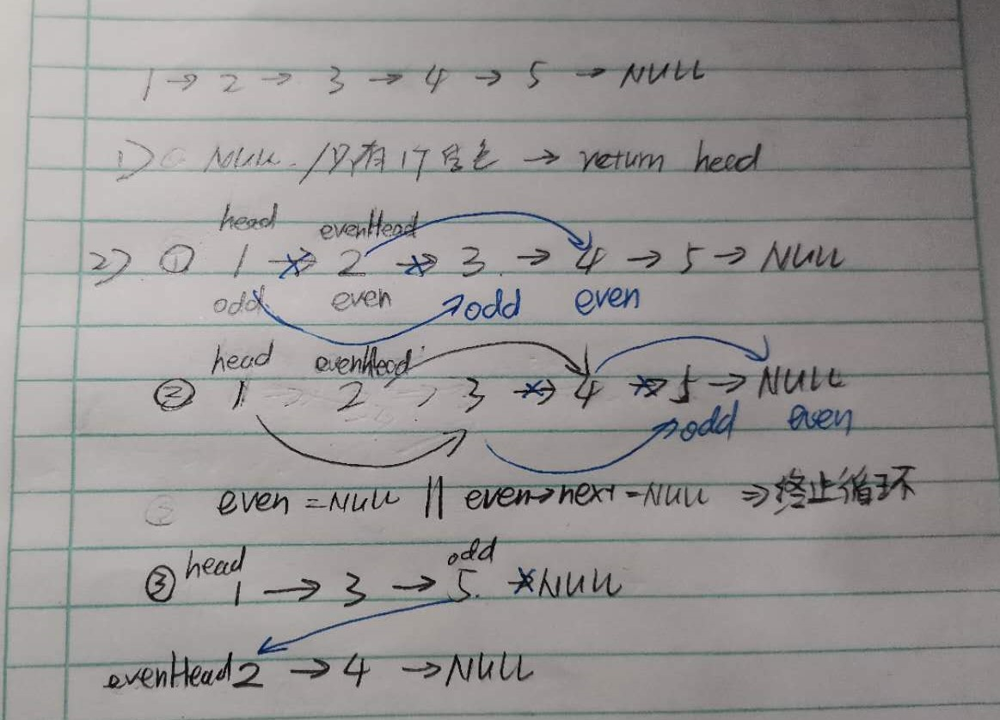

# Leetcode 链表专题

注:T445需要用到栈的知识，所以还没做

### 21.合并两个有序链表

输入:1->2->4, 1->3->4 输出:1->1->2->3->4->4

#### 方法一:较常规的方法

思路：类似于栈，两个链表头的数字比大小，小的取出(即连接该结点，然后指针后移)，如此循环直至某一个链表为空表后。然后把非空表直接接在后面即可。

[注意事项:1.检查输入(若有一个表为空表则直接输出另一个表)。2.表头内存的申请 以及 声明指向表头的指针(指向指针的指针) 3.直接通过next指向l1、l2的结点来构造输出的链表(不应取值，申请内存空间啥的) 4.注意先连接链表，再将指针往后移  5.返回值不应包含表头]

```c
/**
 * Definition for singly-linked list.
 * struct ListNode {
 *     int val;
 *     struct ListNode *next;
 * };
 */
struct ListNode* mergeTwoLists(struct ListNode* l1, struct ListNode* l2){
    if(!l1) return l2;        //Tips 1
    if(!l2) return l1;
    struct ListNode* Head = (struct ListNode*)malloc(sizeof(struct ListNode)),*t=Head;  //Tips2
    while(l1 && l2)
    {
        if(l1->val < l2->val)
        {
            t->next=l1;           //Tips 3 4
            l1=l1->next;
        }
        else
        {
            t->next=l2;
            l2=l2->next;
        }
        t=t->next;
    }
    if(l1) t->next=l1;          //因为两个链表肯定有一个先空，所以这两步至少有一步会执行，不需要把t接地(NULL)
    if(l2) t->next=l2;
    return Head->next;       //Tip 5
}
```

#### 方法二:递归***

思路:1.终止条件:其中一个链表遍历完了(为空)  2.每次递归内容:令数值小的结点指向下一次递归，返回该节点的指针

```c
struct ListNode* mergeTwoLists(struct ListNode* l1, struct ListNode* l2){
    if(!l1) return l2;
    if(!l2) return l1;
    if(l1->val < l2->val)
    {
        l1->next=mergeTwoLists(l1->next,l2);
        return l1;
    }
    else
    {
        l2->next=mergeTwoLists(l1,l2->next);
        return l2;
    }
}
```

### 160.相交链表***

题目描述:寻找两个链表相交的结点

思路:如果两个链表长度相同的话，那么很方便，直接从前往后遍历，寻找两链表中第一个地址相同的结点即可。但是链表长度不等的情况下，可以尝试用缩短或伸长(合并)的方法把链表变成等长。此处用的是合并的方法。

(from github)如果只是判断是否存在交点，那么就是另一个问题，即 编程之美3.6的问题。有两种解法：

- 把第一个链表的结尾连接到第二个链表的开头，看第二个链表是否存在环；
- 或者直接比较两个链表的最后一个节点是否相同。


```c
struct ListNode *getIntersectionNode(struct ListNode *headA, struct ListNode *headB) {
    if(headA==NULL || headB==NULL) return NULL;
    struct ListNode* la=headA;
    struct ListNode* lb=headB;
    while(la != lb)
    {
        la= (la==NULL)?headB:la->next; //链表D
        lb= (lb==NULL)?headA:lb->next; //链表C
    }
    return la;
}
```

### 206.反转链表

输入:1->2->3->4->5->NULL 输出:5->4->3->2->1->NULL

#### 方法一:头插法**

每次把链表新的结点插入在表头后面，即可实现反转


```c
struct ListNode* reverseList(struct ListNode* head){
    if(head==NULL || head->next==NULL) return head;
    struct ListNode* output= (struct ListNode*)malloc(sizeof(struct ListNode));
    struct ListNode* p=head;struct ListNode*q;struct ListNode*temp;
    output->next=NULL;
    while(p!=NULL)
    {
        temp=output->next;   //每一次都回到表头后一个(新结点p插入在表头和temp之间)
        q=p->next;
        output->next=p;
        p->next=temp;
        p=q;
    }
    return output->next;
}
```

#### 方法二:递归法*** *


```c
struct ListNode* reverseList(struct ListNode* head){
    if(head==NULL || head->next==NULL) return head;
    struct ListNode* next;
    struct ListNode* newhead;
    next=head->next;
    newhead=reverseList(next);
    next->next=head;
    head->next=NULL;
    return newhead;
}
```

### 83.删除排序链表中的重复元素

```
Given 1->1->2, return 1->2.
Given 1->1->2->3->3, return 1->2->3.
```

#### 方法一:遍历法**

思路:从头到尾遍历链表，若当前结点的值等于后一结点的值，则将下一个结点删去。(注意:只用一个指针即可实现)

```c
struct ListNode* deleteDuplicates(struct ListNode* head){
    if(head==NULL || head->next==NULL) return head;
    struct ListNode* tmp=head;
    while(tmp!=NULL && tmp->next!=NULL)
    {
        if(tmp->val == tmp->next->val)
            tmp->next = tmp->next->next;   //删掉下一个结点
        else
            tmp=tmp->next;
    }
    return head;
}
```

#### 方法二:递归法***

每次递归，比较当前结点和下一结点的值，若相同则返回下一结点的指针(即删除了当前结点)

(总体上可以理解为，从最后一个值往前比较，若前一个值和当前值相等，则把前一个结点删除，即返回当前结点的地址，而不是返回前一个结点的地址，而第一个和第二个结点是在最后一次比较)

(from leetcode)递归套路解决链表问题：

1. 找终止条件：当head指向链表只剩一个元素的时候，自然是不可能重复的，因此return
2. 想想应该返回什么值：应该返回的自然是已经去重的链表的头节点
3. 每一步要做什么：宏观上考虑，此时head.next已经指向一个去重的链表了，而根据第二步，我应该返回一个去重的链表的头节点。因此这一步应该做的是判断当前的head和head.next是否相等，如果相等则说明重了，返回head.next，否则返回head
4. https://lyl0724.github.io/2020/01/25/1/

```c
struct ListNode* deleteDuplicates(struct ListNode* head){
    if(head==NULL || head->next==NULL) return head;
    head->next=deleteDuplicates(head->next);
    return (head->val == head->next->val)?head->next:head;
}
```

### 19.删除链表的倒数第N个结点（Medium）

#### 方法:快慢指针法*** *

下面的动画中设置了哑结点(开头的虚拟结点)，代码中没有用到虚拟节点，但基本思路相同

#### 


```c
struct ListNode* removeNthFromEnd(struct ListNode* head, int n){
    struct ListNode* fast=head;
    struct ListNode* slow=head;
    while(n-- >0)
    {
        fast=fast->next;
    }
    if(fast==NULL) return head->next; //特殊情况 n==链表长度 即要删去的是第一个结点
    while(fast->next !=NULL)
    {
        fast=fast->next;
        slow=slow->next;
    }
    slow->next=slow->next->next;
    return head;
}
```

### 24.两两交换链表中的结点

#### 方法:递归**(掌握递归三部曲)

```
给定 1->2->3->4, 你应该返回 2->1->4->3.
```

from(https://lyl0724.github.io/2020/01/25/1/)

直接上三部曲模版：

1. **找终止条件。** 什么情况下递归终止？没得交换的时候，递归就终止了呗。因此当链表只剩一个节点或者没有节点的时候，自然递归就终止了。
2. **找返回值。** 我们希望向上一级递归返回什么信息？由于我们的目的是两两交换链表中相邻的节点，因此自然希望交换给上一级递归的是已经完成交换处理，即已经处理好的链表。
3. **本级递归应该做什么。** 结合第二步，看下图！由于只考虑本级递归，所以这个链表在我们眼里其实也就三个节点：head、head.next、已处理完的链表部分。而本级递归的任务也就是交换这3个节点中的前两个节点，就很easy了。


```c
struct ListNode* swapPairs(struct ListNode* head){
    if(head==NULL || head->next==NULL ) return head;
    struct ListNode* next=head->next;
    head->next=swapPairs(next->next);  //由上图可知，已处理完的链表部分返回给head->next
    next->next=head;
    return next;         //处理完后的链表部分从next结点开始，所以应返回next
}
```

### 234.回文链表

判断一个链表是否为回文链表

#### 方法一:辅助数组法

由于是单链表，只能沿一个方向遍历，双指针无法进行，于是把链表的值存在数组当中，再利用数组来比较是否为回文。(c语言直接用下标就可遍历)

(比较简单，就不贴代码了)

#### 方法二:快慢指针+反转链表*** *

使用快慢指针找出单链表的中点，把单链表切断(中点前一元素指向NULL)，把后半部分链表反转，然后比较两个链表是否完全一样。


```c
void cut(struct ListNode* head,struct ListNode* cutNode);
struct ListNode* reverse(struct ListNode* head);
bool IsEqual(struct ListNode* l1,struct ListNode* l2);

bool isPalindrome(struct ListNode* head){
    if(head==NULL || head->next==NULL) return true;
    struct ListNode* slow=head;
    struct ListNode* fast=head;
    while(fast!=NULL && fast->next!=NULL)
    {
        fast=fast->next->next;            //慢指针走一步，快指针走两步，最后把单链表分为以慢指针分成两部分
        slow=slow->next;
    }
    cut(head,slow);
    if(fast!=NULL) slow=slow->next;    //如果是奇数个结点，那么cut后将slow后移一位再reverse，就将中间的结点扔掉了，但其实不这么做也是可以的，因为在IsEqual函数中while的判断条件里是&&，即使不把中间的点扔掉，它也不会加入判断，结果是一样的
    return IsEqual(head,reverse(slow));
}
void cut(struct ListNode* head,struct ListNode* cutNode){ //在slow结点前砍断链表
    while(head->next!=cutNode)
        head=head->next;
    head->next=NULL;
}
struct ListNode* reverse(struct ListNode* head)  //头插法*****反转后面一部分(头插法应熟练掌握)
{
    struct ListNode* newHead=NULL;
    while(head!=NULL)
    {
        struct ListNode* nextNode=head->next;
        head->next=newHead;
        newHead=head;
        head=nextNode;
    }
    return newHead;
}
bool IsEqual(struct ListNode* l1,struct ListNode* l2){
    while(l1!=NULL && l2 !=NULL)
    {
        if(l1->val != l2->val) return false;
        l1=l1->next;
        l2=l2->next;
    }
    return true;
}
```

### 725.分隔链表(Medium)

题目理解:把一个链表分割成K个连续的部分，要求任意两部分的长度差距不能超过1，前面的部分的长度应该大于等于后面部分的长度，有些部分可能为NULL。[就是类比给n个孩子分k个苹果，先平均分，然后剩下的苹果从前往后一个个给]


```c
//总体思路:类比给k个孩子分N个苹果，先平均分，再把多的从头往后分(实际操作时，是两个部分一起分的，因为要按照原来的顺序分)
//1.申请内存(注意是二维指针)[一段连续二维指针，便可写成数组的格式，用下标访问，output[i]对应的是第i个链表的表头]
//2.遍历链表得到length,算出mod-平均分完后多出来的结点数,size-每个部分本应有的结点数
//3.循环 分割链表(注意特殊情况:length<k,k以后的部分都应是NULL)
//3中的亮点:curSize的计算
//注意点:还有一个 *returnSize 参数需要赋值。 (因为传进来的是指针，直接赋值即可)
struct ListNode** splitListToParts(struct ListNode* root, int k, int* returnSize){
    struct ListNode** output=(struct ListNode**)malloc(k*sizeof(struct ListNode*)); //注意申请内存的表达式
    int length=0;
    struct ListNode* cur=root;
    while(cur!=NULL)
    {
        length++;
        cur=cur->next;
    }
    cur=root;                //遍历后不能忘了把指针重置到链表开头/
    int mod=length%k;
    int size=length/k;
    for(int i=0;i<k;i++)
    {
        output[i]=cur;  //如果i<k但是cur==NULL  那么证明是特殊情况(length<k) 只将cur(即NULL)赋给数组元素 后面的都不执行
        if(cur!=NULL)
        {        
            int curSize=size+(mod-- >0? 1:0);            //亮点
            for(int j=0; j<curSize-1; j++) cur=cur->next;   //分割链表
            struct ListNode* next=cur->next;
            cur->next=NULL;
            cur=next;
        }
    }
    *returnSize=k;                //题目中的一个参数(用来返回链表个数？？？)
    return output;
}
```

### 328.奇偶链表

题目描述:给定一个单链表，把所有的奇数节点和偶数节点分别排在一起。请注意，这里的奇数节点和偶数节点指的是节点编号的奇偶性，而不是节点的值的奇偶性。

```
Example:
Given 1->2->3->4->5->NULL,
return 1->3->5->2->4->NULL.
```



```c
//这题比较简单
//直接通过修改指针把链表拆分成 奇数位置链表 和 偶数位置链表， 然后把偶数链表头接到奇数链表尾即可
struct ListNode* oddEvenList(struct ListNode* head){
    if(head ==NULL || head->next==NULL) return head;
    struct ListNode* evenHead=head->next;  //记录偶数位置链表的表头，用于最后奇偶相连
    struct ListNode* odd=head;            //奇数位置指针
    struct ListNode* even=odd->next;      //偶数位置指针
    while(even!=NULL && even->next!=NULL)
    {
        odd->next=odd->next->next;         //指向后面第二个结点，即把奇数和偶数分开了
        even->next=even->next->next;
        odd=odd->next;
        even=odd->next;
    }
    odd->next=evenHead;
    return head;
}
```

