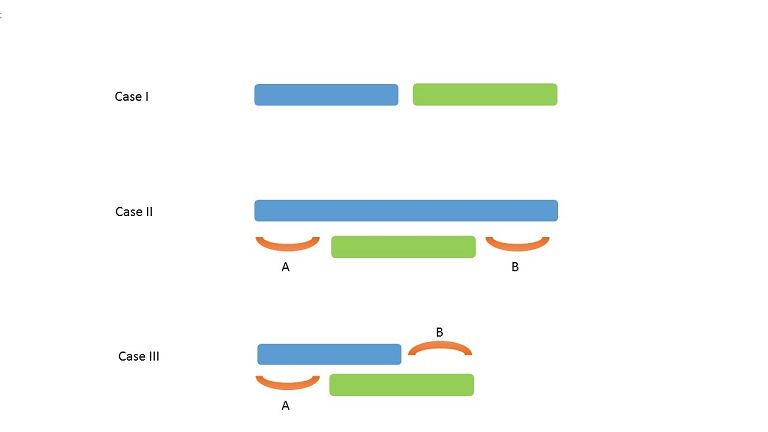

# Leetcode-greedy-algorithm

## 目录

[455.分发饼干](#A1)

[435.无重叠区间](#A2)

[452.用最少数量的箭引爆气球](#A3)

[406.根据身高重建队列](#A4)

[121.买卖股票的最佳时机](#A5)

[122.买卖股票的最佳时机II](#A6)

[605.种花问题](#A7)

[392.判断子序列](#A8)

[665.非递减数列](#A9)

[53.最大子序列和](#A10)

[763.划分字母区间](#A11)


### <span id="A1">455.分发饼干</span>

```
每个孩子有一个满足度grid，每一个饼干有一个大小size，每个孩子只能分到一块饼干，当饼干大小大于等于一个孩子满足度时，这个孩子会满足。给定若干个饼干大小和若干个孩子的满足度，求解最多可以满足的孩子个数。
```

贪婪算法通过局部最优以追求全局最优。由于满足度最小的孩子最容易满足，那么优先考虑他。算法先将两个所给的数组排序，然后用双指针法。从最小的饼干和最小满足度的孩子开始，若饼干能满足孩子，那么count++,而且两个指针向后移；如果不能满足。那么指向饼干的指针向后移。

(如何  证明此情况中贪婪算法的局部最优最后一定推出全局最优 ？？)

下面的反证法来自[Cyc2018](https://github.com/CyC2018/CS-Notes/blob/master/notes/Leetcode%20%E9%A2%98%E8%A7%A3%20-%20%E8%B4%AA%E5%BF%83%E6%80%9D%E6%83%B3.md#1-%E5%88%86%E9%85%8D%E9%A5%BC%E5%B9%B2)的题解中  

```
在以上的解法中，我们只在每次分配时饼干时选择一种看起来是当前最优的分配方法，但无法保证这种局部最优的分配方法最后能得到全局最优解。我们假设能得到全局最优解，并使用反证法进行证明，即假设存在一种比我们使用的贪心策略更优的最优策略。如果不存在这种最优策略，表示贪心策略就是最优策略，得到的解也就是全局最优解。

证明：假设在某次选择中，贪心策略选择给当前满足度最小的孩子分配第 m 个饼干，第 m 个饼干为可以满足该孩子的最小饼干。假设存在一种最优策略，可以给该孩子分配第 n 个饼干，并且 m < n。我们可以发现，经过这一轮分配，贪心策略分配后剩下的饼干一定有一个比最优策略来得大。因此在后续的分配中，贪心策略一定能满足更多的孩子。也就是说不存在比贪心策略更优的策略，即贪心策略就是最优策略。
```


```c
int sort(const void* a,const void* b)
{
    return *(int*)a>*(int*)b;
}
int findContentChildren(int* g, int gSize, int* s, int sSize){
    qsort(g,gSize,sizeof(int),sort);  //qsort的四个参数分别是要排序的数组、数组元素个数、数组内元素大小、自定义的比较函数
    qsort(s,sSize,sizeof(int),sort);
    int child=0,cookie=0,count=0;
    while(child<gSize&&cookie<sSize)
    {
        if(s[cookie]>=g[child])
        {
            child++;cookie++;count++;
        }
        else 
           cookie++;
    }
    return count;
}
```

### <span id="A2">435.无重叠区间</span>

```
给定一个区间的集合，找到需要移除区间的最小数量，使剩余区间互不重叠。

注意：

 1.可以认为区间的终点总是大于它的起点。
		2.区间 [1,2] 和 [2,3] 的边界相互“接触”，但没有相互重叠。
```

算法:用贪婪算法的思想，从前往后求局部最优。首先把所给的区间排序。然后对比第二个区间和第一个区间，有三种情况。(下图来自Leetcode官方题解)



①区间不相交，不用做处理；   而二三情况都有相交，那么在此时应该留下终点小的那一个，这样才更有可能达到最优

②去掉前一个区间  ③去掉后一个区间

具体实现:先用qsort进行排序，自定义排序的例程中，若起点不同则按照起点排序，若起点相同则按照终点排序。然后从用min记录当前区间的终点位置，和下一个区间的起点位置进行比较，三种情况分别处理，循环直至所有区间都比较完毕。

```c
int cmp(int** val1,int** val2)
{
    if(val1[0][0]==val2[0][0]) return val1[0][1]-val2[0][1];
    return val1[0][0]-val2[0][0];
}
int eraseOverlapIntervals(int** intervals, int intervalsSize, int* intervalsColSize){
    if(intervalsSize<2) return 0;
    qsort(intervals,intervalsSize,sizeof(intervals[0]),cmp);  //区间排序
    int count=0;
    int min=intervals[0][1],i=1;
    while(i<intervalsSize)
    {
        if(intervals[i][0]<min)   //有重叠部分
        {
            if(intervals[i][1]<min)  //当前区间被前一区间包含，移除前一区间;(如果此判断结果为否，那么因此要去结尾最小的区间，min就不改变)
               min=intervals[i][1];
            count++;
        }
        else  //没有重叠部分
            min=intervals[i][1];
        i++;    
    }
    return count;
}
```

### <span id="A3">452.用最少数量的箭引爆气球</span>

```
题目描述：在二维空间中有许多球形的气球。对于每个气球，提供的输入是水平方向上，气球直径的开始和结束坐标。由于它是水平的，所以y坐标并不重要，因此只要知道开始和结束的x坐标就足够了。开始坐标总是小于结束坐标。平面内最多存在104个气球。

一支弓箭可以沿着x轴从不同点完全垂直地射出。在坐标x处射出一支箭，若有一个气球的直径的开始和结束坐标为 xstart，xend， 且满足  xstart ≤ x ≤ xend，则该气球会被引爆。可以射出的弓箭的数量没有限制。 弓箭一旦被射出之后，可以无限地前进。我们想找到使得所有气球全部被引爆，所需的弓箭的最小数量。
```


```c
//通过qsort把区间根据end来排序
//然后对于从第一个区间开始，如果后面的区间start小于等于第一个区间的end，那么就可以一箭刺穿
//如果大于 那么需要加一根箭，并且从该区间end往后找
int cmp(int** val1,int** val2)
{
    return val1[0][1]-val2[0][1];
}
int findMinArrowShots(int** points, int pointsSize, int* pointsColSize){
    if(pointsSize==0) return 0;
    int arrows=1;
    qsort(points,pointsSize,sizeof(points[0]),cmp);
    int tmp_end=points[0][1];
    int i=1;
    while(i<pointsSize)
    {
        if(points[i][0]>tmp_end)
        {
            arrows++;
            tmp_end=points[i][1];           
        }
        i++;
    }
    return arrows;
}
```

### <span id="A4">406.根据身高重建队列</span>

```
假设有打乱顺序的一群人站成一个队列。 每个人由一个整数对(h, k)表示，其中h是这个人的身高，k是排在这个人前面且身高大于或等于h的人数。 编写一个算法来重建这个队列。

注意：
总人数少于1100人。

示例
输入:
[[7,0], [4,4], [7,1], [5,0], [6,1], [5,2]]
输出:
[[5,0], [7,0], [5,2], [6,1], [4,4], [7,1]]
```

算法思想:算法的基础是高个子是“看不见”前面的矮个子的，因此如果把矮个子插在已经排序好的高个子前面。对于他们的k是不造成影响的。因此如果把数组按照身高降序排列，(若身高相同则按照k升序排列)。那么只需要依次按照他们的k作为下标来插入就行了。

解释:假设他们的身高相同，那么结果中k就是他们的下标。在身高不同的情况下，因为前面已经是从高到低来排序了。比如目前已经插入了[7,0]，下一个要插入[7,1]，因为1下标上没有元素，那么直接插入就可。如果下面继续插入[6,1]，那么此时一下标上有[7,1]了，就把[7,1]以及后面的元素(如果有的话)往后移，然后把[6,1]插入到1下标的位置，因为在[6,1]插入前，已经插入的元素h都是大于等于6的(就算h等于6，那k也是小于当前的1的)，所以它此时应该被放在第二个位置(即下标为1)，同时由于它的h肯定比后面元素的h小，不会影响后面元素的有序性。

C语言具体实现:qsort进行排序，在插入时使用memmove来实现区间整体的后移，memmove有三个参数(目的地址，原地址，拷贝部分的长度)

```c
int cmp(const void* a,const void* b)
{
    int* peopleA=*(int**)a;
    int* peopleB=*(int**)b;
    int hA=peopleA[0],kA=peopleA[1],hB=peopleB[0],kB=peopleB[1];
    if(hA==hB) return kA-kB;  //高度相同时 按照人数升序
    return hB-hA;  //高度不同时 按照高度降序
}
int** reconstructQueue(int** people, int peopleSize, int* peopleColSize, int* returnSize, int** returnColumnSizes){
    if(peopleSize==0)
    {
        *returnSize=0;
        return NULL;
    }
    qsort(people,peopleSize,sizeof(int*),cmp);
    *returnSize=peopleSize;
    int** result=(int**)malloc(sizeof(int*)*peopleSize);
    for(int i=0;i<peopleSize;i++)
    {
        int k=people[i][1];   //目的地下标
        memmove(&result[k+1],&result[k],sizeof(int*)*(i-k));
        result[k]=(int*)malloc(sizeof(int)*2);
        result[k][0]=people[i][0];
        result[k][1]=people[i][1];
    }
    *returnColumnSizes=(int*)malloc(sizeof(int)*peopleSize);
    for(int i=0;i<peopleSize;i++)
    {
        (*returnColumnSizes)[i]=2;
    }
    return result;
}
```

### <span id="A5">121.买卖股票的最佳时机</span>

```
题目描述:给定一个数组，它的第 i 个元素是一支给定股票第 i 天的价格。

如果你最多只允许完成一笔交易（即买入和卖出一支股票一次），设计一个算法来计算你所能获取的最大利润。

注意：你不能在买入股票前卖出股票。
```


```c
//算法思想:从当前遇到的最小值开始划分区段，计算每个区段的最高差价；(假设前面有一个最小值5，然后现在遇到了2，那么如果后面股票继续上升价格，和5也没有关系了，因为从2买入肯定比从5买入利润高。因此5到2之前的元素时一个区间，2以后是另一个区间)
//从前向后遍历
//记录当前遇到的最小值和最大值
//注意 最大值应该在最小值之后， 因此 若最小值更新了就把最大值也更新成与之相同 
//每次得出最大值和最小值的时候就和max比较取最大
int maxProfit(int* prices, int pricesSize){
    if(pricesSize==0) return 0;
    int result=0,max=prices[0],min=prices[0];
    for(int i=1;i<pricesSize;i++)
    {
        if(prices[i]>max)   //股票价格上升了
        {
            max=prices[i];
            result=fmax(max-min,result);
        }
        else if(prices[i]<min)  //最低价格下降了
        {
            min=max=prices[i];
        }
    }
    return result;
}
```

### <span id="A6">122.买卖股票的最佳时机II</span>

```
题目描述:给定一个数组，它的第 i 个元素是一支给定股票第 i 天的价格。

设计一个算法来计算你所能获取的最大利润。你可以尽可能地完成更多的交易（多次买卖一支股票）。

注意：你不能同时参与多笔交易（你必须在再次购买前出售掉之前的股票）。
```

 

```c
//方法一 分区间计算
//类似121分区段求最大值 只不过121是把不同区段的最大值取最大的作为结果 而此题是把最大值相加
//但是和121分区段的方法有些不同，121中是遇到小于当前最小值的值的时候划分新的区段，此题是升序区段划分开来
int maxProfit(int* prices, int pricesSize){
    if(pricesSize==0) return 0;
    int profit=0,min=prices[0];
    for(int i=1;i<pricesSize;i++)
    {
        if(prices[i-1]>prices[i]) //“升序”序列结束(其实是非递减序列)   计算此区段的最大值
        {
            profit += prices[i-1]-min;
            min=prices[i];
        }
        if(i==pricesSize-1)
            profit += prices[i]-min;
    }
    return profit;
}

//方法二    贪婪算法
//直接计算每天差价，若因为分区间计算就是升序序列直接相邻天差价的和，   直接遍历一次数组，如果相邻两天差价为正，就加到利润中
int maxProfit(int* prices, int pricesSize){
    if(pricesSize==0) return 0;
    int profit=0;
    for(int i=1;i<pricesSize;i++)
       if(prices[i]>prices[i-1])
          profit += prices[i]-prices[i-1];
    return profit;
}
```

### <span id="A7">605.种花问题</span>

```
假设你有一个很长的花坛，一部分地块种植了花，另一部分却没有。可是，花卉不能种植在相邻的地块上，它们会争夺水源，两者都会死去。

给定一个花坛（表示为一个数组包含0和1，其中0表示没种植花，1表示种植了花），和一个数 n 。能否在不打破种植规则的情况下种入 n 朵花？能则返回True，不能则返回False。

示例 1:
	输入: flowerbed = [1,0,0,0,1], n = 1
	输出: True
示例 2:
	输入: flowerbed = [1,0,0,0,1], n = 2
	输出: False
```

算法思想:遍历数组，如果遇到0，那么判断其左边和右遍是不是0，如果都是0，就把数组当前位置改成1，然后count加一。

```c
bool canPlaceFlowers(int* flowerbed, int flowerbedSize, int n){
    int i=0,count=0;
    while(i<flowerbedSize)
    {
        if( flowerbed[i]==0 && (i==0||flowerbed[i-1]==0) && (i==flowerbedSize-1||flowerbed[i+1]==0) ) //注意判断式的写法(要学会合理利用短路)
        {
            flowerbed[i]=1;
            count++;
        }
        i++;
    }
    if(count<n) return false;
    return true;
}
```

### <span id="A8">392.判断子序列</span>

```
题目描述:给定字符串 s 和 t ，判断 s 是否为 t 的子序列。

你可以认为 s 和 t 中仅包含英文小写字母。字符串 t 可能会很长（长度 ~= 500,000），而 s 是个短字符串（长度 <=100）。

字符串的一个子序列是原始字符串删除一些（也可以不删除）字符而不改变剩余字符相对位置形成的新字符串。（例如，"ace"是"abcde"的一个子序列，而"aec"不是）。
```

算法思想:因为子序列不一定是在原序列中连续分布的。那么给定s和t，先在t中找是否存在s的第一个字母，找到后，对于t剩下来的后面的字符串，找s的第二个字母，找下去直到s或t找到最后了。

利用双指针很容易实现，最后判断指向s的指针的位置就可以知道是否为子序列。

```c
bool isSubsequence(char * s, char * t){
    int lengthS=strlen(s);
    int lengthT=strlen(t);
    int pS,pT=0;
    while(pS<lengthS && pT<lengthT)
    {
        if(s[pS]==t[pT]) pS++;
        pT++;
    }
    if(pS==lengthS) return true;
    return false;
}
```

### <span id="A9">665.非递减数列</span>

```
题目描述:给你一个长度为 n 的整数数组，请你判断在 最多 改变 1 个元素的情况下，该数组能否变成一个非递减数列。

我们是这样定义一个非递减数列的： 对于数组中所有的 i (0 <= i <= n-2)，总满足 nums[i] <= nums[i + 1]。
```

算法思想:遍历一次数组，判断是否非递减。如果出现 nums[i]<nums[i-1]，那么就要知道修改哪一个数，正常情况下，把 nums[i-1]=nums[i]，这样nums[i]就没有变大，在后面的比较中更有可能是非递减的。但是如果 nums[i]<nums[i-2]，那么此时如果像前面那样改变，不会使这个数列变成非递减的，于是只能把 nums[i]=nums[i-1]。

```c
bool checkPossibility(int* nums, int numsSize){
    int count=0;
    for(int i=1;i<numsSize&& count<2;i++)
    {
        if(nums[i]>=nums[i-1])
            continue;
        count++;
        if(i>1&&nums[i]<nums[i-2])
           nums[i]=nums[i-1];
        else 
           nums[i-1]=nums[i];
    }
    return count<=1;
}
```

### <span id="A10">53.最大子序列和</span>

```
给定一个整数数组 nums ，找到一个具有最大和的连续子数组（子数组最少包含一个元素），返回其最大和。

示例:
输入: [-2,1,-3,4,-1,2,1,-5,4],
输出: 6
解释: 连续子数组 [4,-1,2,1] 的和最大，为 6。
```

算法思想：如果前面一部分子序列A的和已经小于0了，那么A再往后面累加就没有意义了，因为假设A+B是最大子序列和，而A小于0，那么B应该才是最大子序列和，是矛盾的。所以定义一个当前子序列的和，如果当前子序列的和小于0，就把他变为当前下标指向的值。

```c
int maxSubArray(int* nums, int numsSize){
    if(nums==NULL || numsSize==0) return 0;
    int maxSum=nums[0];
    int tmpMax=nums[0];
    for(int i=1;i<numsSize;i++)
    {
        tmpMax = tmpMax>0? tmpMax+nums[i]:nums[i];
        maxSum=fmax(tmpMax,maxSum);
    }
    return maxSum;
}
```

### <span id="A11">763.划分字母区间</span>

```
字符串 S 由小写字母组成。我们要把这个字符串划分为尽可能多的片段，同一个字母只会出现在其中的一个片段。返回一个表示每个字符串片段的长度的列表。

示例 1：
输入：S = "ababcbacadefegdehijhklij"
输出：[9,7,8]
解释：
划分结果为 "ababcbaca", "defegde", "hijhklij"。
每个字母最多出现在一个片段中。
像 "ababcbacadefegde", "hijhklij" 的划分是错误的，因为划分的片段数较少。
```

算法思想:遍历字符串数组，比如第一个字母是‘a’,当前区间的最小的结尾就是最后一个‘a’所在的位置，而第一个‘a’和最后一个'a'，之间的字母可能会使区间扩大。因此，对于每个遇到的字母，找到字母最后一次出现的位置，用来更新当前的最小区间。

```c
//用last数组记录每个字母最后出现的下标
//anchor和end表示当前区间的首尾
//如果遇到的字母最后一次出现的下标大于end，就把end更新
//如果遍历到了区间结尾(即i==end)，就把该区间记录到答案中，然年后更新anchor=i+1，去找下一个区间。
#define numsOfLetter 26
int* partitionLabels(char * S, int* returnSize){
    int* output=(int*)malloc(sizeof(int)*500);
    *returnSize=0;
    if(S==NULL) return NULL;
    int* last=(int*)malloc(sizeof(int)*numsOfLetter);
    for(int i=0;i<strlen(S);i++)   //遍历一次字符串数组，找到每个字母的最后位置
       last[S[i]-'a']=i;
    int anchor=0,end=0;  //anchor end分别是当前区间的开头和结尾
    for(int i=0;i<strlen(S);i++)
    {
        end=fmax(end,last[S[i]-'a']);
        if(i==end)  //证明已经找到了一个字母区间
        {
            output[(*returnSize)++]=end-anchor+1;
            anchor=i+1;
        }
    }
    free(last);
    return output;
}
```

